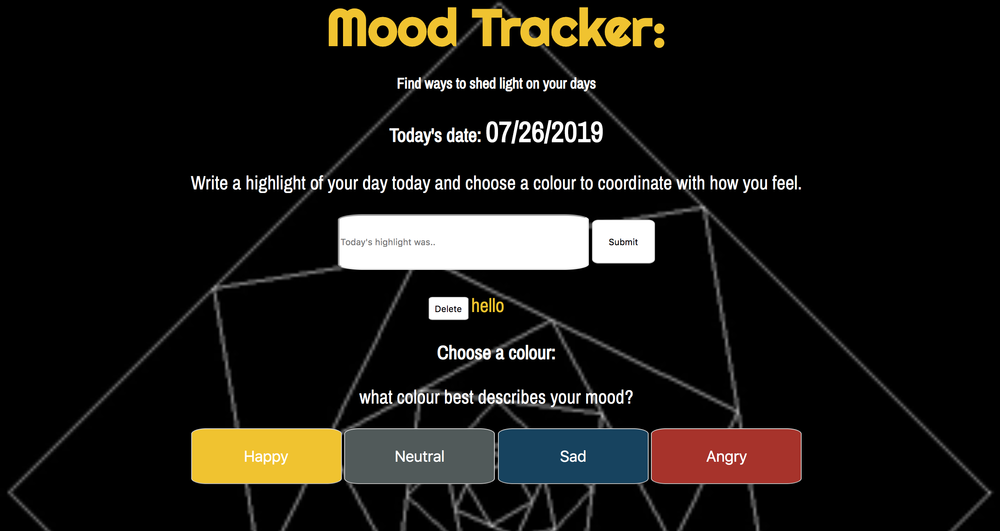

# Mood Tracker
This a full stack application. Users can write a highlight about their day and choose a colour that they think best aligns with their mood.

## How it's made:
**Tech Used** I used ES6, an HTML template file CSS, Node.js, MongoDB and Express.js.

## Optimizations
If I had more time I would have definitely loved to add more items to the list and more mood/colour choices. The way the app is coded now, users are only able to add one highlight to their day and choose from 4 colours. Also, my application is not responsive and I'd like to return to this app and add that important feature. 

## Lesson Learned
Along with the challenges that came with building this to do list, I spent time studying JavaScript to make the functions behave accordingly. I learned a lot about how to tackle issues by reading about how loops and functions work together to make everything come together cohesively and work functionally.
